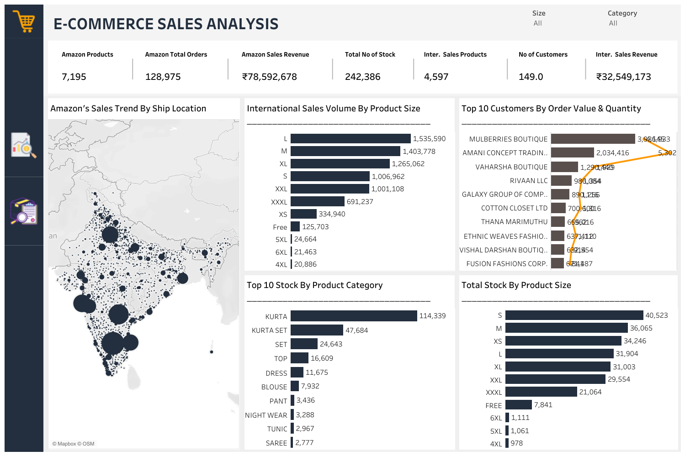

# E-Commerce Sales Analysis

## Project Overview
### Introduction:
The E-Commerce Sales Analysis project is designed to offer a detailed examination of the profitability and performance of e-commerce sales within the Indian market. This analysis focuses on data collected from various sales channels like Amazon and other channels over a four-month period, from March 2022 to June 2022, encompassing a wide range of products. Using the outcome of this analysis project, retailers and digital marketers can measure the performance of their campaigns more accurately and efficiently.

## Objectives:
The primary objectives of this E-Commerce Sales Analysis project are:
- Evaluate Amazon's order status by product quantity to understand fulfillment efficiency.
- Analyze Amazon's sales data segmented by order status to identify key factors impacting sales completion.
- Examine Amazon's sales by product size to determine which sizes are most profitable.
- Identify trends in Amazon's revenue over the months to track growth and seasonal impacts.
- Analyze Amazon's revenue trends by product category to pinpoint top-performing categories.
- Evaluate Amazon's sales trends by ship-location to identify regional sales patterns.
- Assess international sales volume by product size to determine global demand patterns.
- Identify the top 10 customers by order value and quantity to recognize key customer segments.
- Determine the top 10 stock items by product category to manage inventory effectively.
- Analyze total stock by product size to ensure optimal stock levels across all sizes.

### Expected Outcomes:
- __Product Quantity Order Status Insights:__ Detailed insights into Amazon's order pattern by product quantity, fulfillment efficiency, and areas for improvement.
- __Sales Performance Reports:__ Comprehensive reports on sales performance by order status, aiding in understanding sales fulfilment patterns.
- __Product Size Profitability:__ Clear identification of which product sizes drive the most sales and profit.
- __Revenue Trend Analysis:__ Monthly revenue trend analysis providing insights into growth patterns and seasonal effects.
- __Category Performance Insights:__ Detailed revenue trends by product category, highlighting top-performing categories.
- __Regional Sales Patterns:__ Geographic sales trend analysis by ship location to inform regional marketing and distribution strategies.
- __Global Sales Insights:__ Insights into international sales volumes by product size, guiding global market strategies.
- __Key Customer Identification:__ Identification of top 10 customers, aiding in targeted marketing and customer retention efforts.
- __Inventory Management:__ Reports on top stock items by category, assisting in effective inventory management.
- __Stock Level Optimization:__ Analysis of total stock by product size to ensure balanced and sufficient stock levels.

The findings from this project will enable retailers and digital marketers to:
- Measure the performance of their e-commerce campaigns more accurately.
- Make data-driven decisions to enhance profitability.
- Understand market dynamics and consumer behavior in the Indian e-commerce space.

This project aims to bridge the gap between raw sales data and strategic business decisions, providing valuable insights that can drive growth and success in the competitive e-commerce market.

### About The Dataset
This dataset provides a comprehensive overview of e-commerce sales data from different channels covering a variety of products.The dataset also provides an in-depth look at the profitability of e-commerce sales. It contains data on a variety of sales channels, including Shiprocket and INCREFF, as well as financial information on related expenses and profits. The columns contain data such as SKU codes, design numbers, stock levels, product categories, sizes and colors. In addition to this we have included the MRPs across multiple stores like Ajio MRP, Amazon MRP, Amazon FBA MRP, Flipkart MRP, Limeroad MRP Myntra MRP and PaytmMRP along with other key parameters like amount paid by customer for the purchase , rate per piece for every individual transaction Also we have added transactional parameters like Date of sale months category fulfilledby B2b Status Qty Currency Gross amt. This dataset was provided by [Quantum Analytics](https://www.quantumanalyticsco.org/). The tables that contains the raw dataset for this analysis has tables sizes of over 100mb, hence it was too large to upload to github. The data_dictionary table makes a description of all the fields in the key tables of this dataset for a better understanding of them.

Below is a table that describes all the fields in all the tables in this dataset.

| Table                              | Field                    | Description                            |            
|:-----------------------------------|:------------------------ |:-------------------------------------- |
|Cloud Warehouse Compersion Chart    | Shiprocket               | Contains data related to the profitability of e-commece sales throgh shiprocket    |
|                                    | INCREFF                  | Contains data related to the profitability of e-commerce sales through INCREFF     |
|Sales_Report                        | SKU Code                 | Unique identifier for each product         |
|                                    | Design No                | Unique identifier for each design         |
|                                    | Stock                    | Number of items in stock        |
|                                    | Category                 | Type of product         |
|                                    | Size                     | Size of product        |
|                                    | Color                    | Color of product         |
|P_&_L_March_2021                    | Category                 | Type of product         |
|                                    | SKU                      | Unique identifier for each product         |
|                                    | Catelog                  | Category of product        |
|                                    | Weight                   | Weight of product         |
|                                    | TP1                      | Price of the product on the first third-party platform        |
|                                    | TP2                      | Price of the product on the second third-party platform        |
|                                    | MRP Old                  | Original price of product         |
|                                    | Final MRP                | Final price of product after discount       |
|                                    | Ajio MRP                 | Price of the product on Ajio         |
|                                    | Amazon FBA MRP           | Price of the product on Amazon FBA           |
|                                    | Flipkart MRP             | Price of the product on Flipkart       |
|                                    | Limeroad MRP             | Price of the product on Limeroad         |
|                                    | Myntra MRP               | Price of the product on Myntra           |
|                                    | Paytm MRP                | Price of the product on Paytm       |
|                                    | Snapdeal MRP             | Price of the product on Snapdeal         |
|May-2022                            | SKU                      | Unique identifier for each product         |
|                                    | Catelog                  | Category of product        |
|                                    | Weight                   | Weight of product         |
|                                    | MRP Old                  | Original price of product         |
|                                    | Final MRP Old            | Final price of product after discounts       |
|                                    | Ajio MRP                 | Price of the product on Ajio         |
|                                    | Amazon FBA MRP           | Price of the product on Amazon FBA           |
|                                    | Flipkart MRP             | Price of the product on Flipkart       |
|                                    | Limeroad MRP             | Price of the product on Limeroad         |
|                                    | Myntra MRP               | Price of the product on Myntra           |
|                                    | Paytm MRP                | Price of the product on Paytm       |
|                                    | Snapdeal MRP             | Price of the product on Snapdeal         |
|                                    | TP1 & TP2 MRP Old        | Original price of the product           |
|Amazon_Sale_Report                  | Category                 | Type of product       |
|                                    | Size                     | Size of product         |
|                                    | Date                     | Date of the sale           |
|                                    | Status                   | Status of the sale       |
|                                    | Fulfilment               | Metho of fulfilment         |
|                                    | Style                    | Style of the product           |
|                                    | SKU                      | Stock Keeping Unit       |
|                                    | ASIN                     | Amazon Standard Identification Number         |
|                                    | Courier Status           | Status of the courier           |
|                                    | Qty                      | Quanity of the product     |
|                                    | Amount                   | Amount of the sale         |
|                                    | B2B                      | Business to business sale           |
|                                    | Currency                 | The currency used for the sale       |
|International_Sale_Report           | Style                    | Style of the product           |
|                                    | SKU                      | Stock Keeping Unit       |
|                                    | Size                     | Size of product         |
|                                    | Date                     | Date of the sale           |
|                                    | Month                    | Month of the sale           |
|                                    | Customer                 | Name of the customer         |
|                                    | PCS                      | Number of pieces sold           |
|                                    | Rate                     | Rate per piece         |
|                                    | GROSS AMT                | Total amount of sales           |
|Expense_IGF                         | Received Amount          | The total amount of money received from sales           |

### Skills Utilized
1. Data Cleaning
2. Data Modelling
3. Data Visualiziation
4. Descriptive Analytics
5. Critical Thinking and Problem Solving
6. Communication and Reporting

### Tools Used
1. MS SQL Server
    - Was used to:
        1. Extract,
        2. Clean,
        3. Transform,
        4. Load all the datasets for this analysis.
     
2. Tableau (Was used to create dashboards for this analysis)
    - The following Tableau were incorporated:
        1. Calculated Fields
        2. Geospatial Analysis
        3. Page Navigation
        4. Filters
        5. Tooltips
        6. Buttons

### Data Cleaning, Transformation and Loading using MS SQL Server:
1. Made sure that all the data types of the tables in this datatset are of the right data type.
2. Changed the data type of all the table columns with the wrong data type to the right data type.
3. Replaced the null cells of the 'Amount' column of "Amazon Sale Rreport" table with "0".
4. Deleted the scanty 'promotion-ads' column of the "Amazon Sale Report" table as it has little or no value in the table or in my analysis.
5. Deleted the scanty 'Unnamed 22' column of the "Amazon Sale Report" table as it has little or no importance in the table or in my analysis.
6. Deleted the scanty 'fulfilled_by' column of the "Amazon Sale Report" table as it is neither important in the table nor in my analysis.
7. Replace the null cells of the 'Stock' column of the "International Sale Report" table with "0".
8. Used the median weight value from the value in all the cells of the weight column in the "P & L March 2021" table to replace the null cells of the 'Weight' column.
9. Replaced the null cells of the 'TP_2' column of "P & L March 2021" table with "0".
10. Used the median weight value from the value in all the cells of the weight column in the "May-2022" table to replace the null cells of the 'Weight' columns.
11. Replaced the null cells of all the MRP columns in "May-2022" table with "0".
12. Replaced the null cells of all the MRP columns in the "P & L March 2021" table with "0".

**MS SQL Server View**

Sql Query Screenshot                                                               |                                
:---------------------------------------------------------------------------------:|
    

You can preview the MYSQL query file [here](E-Commerce_Sales_Analysis_Project.sql)

## Visualization in Tableau:
#### Report View 1

#### Report View 2

### Project Analysis:
From the analysis, i made the following Key findings below:
- Amazon's Sales Category is __9.__
- Amazon's Products is __7,195.__
- Amazon's Total Order is __128,975.__
- Amazon's Sales Revenue is __₹78,592,678.__
- The Total Number of Stock is __242,386.__
- International Sales Pproducts is __4,597.__
- The Number of Customers is __149.__
- International Sales Revenue is __₹32,549,173.__
-

- 
- **Amazon's Order Status By Product Quantity:**
- In this analysis of Amazon's Order Status By Product Quantity, Shipped products has the highest quantity at 78,009 units, but only 28,886 have been confirmed as delivered, reflecting a 37% delivery rate. There are 5,657 cancellations and 1,970 returns to the seller. Additionally, 977 units have been picked up, 657 are pending, and 283 are pending pickup. Smaller numbers include 150 units returning to the seller, 35 out for delivery, 5 lost in transit, 1 damaged, and 8 currently shipping.

- The high shipment volume indicates strong order processing, but the gap between shipped and delivered items suggests potential delays. The 5,657 cancellations require investigation into possible causes. With 2,120 units being returned, understanding return reasons is essential for improving satisfaction. The 657 pending orders and 283 awaiting pickup may highlight processing inefficiencies. Minimal lost and damaged items indicate effective logistics, which is crucial to maintain. Lastly, the picked-up orders shows the importance of diverse delivery options, indicating that improvements could attract more customers.

- 
- **Amazon's Sales By Order Status:**
- In this analysis of Sales by Order Status, Amazon itself accounts for the majority of sales, totaling 54,322,151 units. In contrast, merchants selling through Amazon contribute significantly less, with 21,080,355 units.

- Amazon's domiantes sales with over 54 million units, showing its top performance on the e-commerce platform. The substantial sales by merchants, at over 21 million units, shows that third-party sellers are also importabt to the overall sales volume. This balance shows the strengh of Amazon's platform in supporting both direct sales and third-party merchants. Both channels could further enhance overall sales performance.

- 
- **Amazon's Sales By Product Size:**
- This analysis presents sales figures for Amazon's e-commerce platform segmented by product size. The medium (M) size has the highest sales with 20,447 units, followed closely by large (L) with 20,000 units. Extra-large (XL) and double extra-large (XXL) sizes follow with 18,923 and 16,516 units, respectively. Small (S) size sales are also substantial at 16,331 units. The sales figures gradually decrease for sizes 3XL (13,524 units), XS (9,943 units), 6XL (688 units), 5XL (513 units), 4XL (398 units), and products marked as "Free" (366 units).

- The data reveals a strong preference for medium and large sizes, which collectively account for a significant portion of total sales. This shows a higher demand for these sizes among consumers. Extra-large and double extra-large sizes also show considerable sales, showcasing a substantial market for larger sizes. Smaller and extremely large sizes (XS, 5XL, 6XL) have lower sales figures, which could indicate a niche market. The "Free" size category, with the lowest sales, might represent products that don't conform to standard sizing.

- 
- **Amazon's Revenue Trend By Month:**
- The analysis provides Amazon's monthly revenue data for March to June 2022. In March 2022, revenue was relatively low at 101,687 units. April 2022 saw a significant spike in revenue, reaching 28,838,708 units. In May 2022, revenue slightly decreased to 26,226,477 units. By June 2022, revenue further declined to 23,425,809 units.

- The notable increase in revenue from March to April may be as a result of a successful marketing campaign, product launch, or seasonal demand surge. The subsequent decrease in May and June indicates a possible stabilization after the peak in April. This trend may highligh the importance of sustaining promotional activities and leveraging factors that drove the April surge. It may be suggested that to maintain revenue growth, Amazon should analyze the causes of the April peak and address the factors contributing to the decline in subsequent months. 

- 
- **Amazon's Revenue Trend By Product Category:**
- This analysis provides revenue data by product category for Amazon from March to June 2022. In March, the "Set" category led with $53,884, followed by "Kurta" at $34,257. April saw a significant increase, with "Set" reaching $15,506,676 and "Kurta" at $8,017,145. Other categories like "Western Dress," "Top," and "Ethnic Dress" also saw substantial revenue increases. May and June continued to show high revenues for "Set" and "Kurta," but with a gradual decline. Categories like "Western Dress" and "Top" remained consistently high, while others like "Blouse," "Bottom," and "Saree" had lower revenues.

- The "Set" and "Kurta" categories consistently generated the highest revenues, showing strong consumer demand. The notable revenue spike in April ,may be as a result of successful promotional activities or seasonal trends. While "Western Dress" and "Top" also performed well, the gradual decline in May and June emphasizes the need to sustain momentum. Lower revenue categories like "Blouse," "Bottom," and "Saree", and others suggest potential areas for growth. A deepr study of these trends can help Amazon sharpen inventory and marketing strategies which will help them capitalize on high-demand products and boost lower-performing categories.

- 
- **International Sales Volume By Product Size:**
- Here, we analyzed the international sales volume for various product sizes. The size "L" leads with the highest sales volume at 1,535,590 units, followed by "M" with 1,403,778 units and "XL" with 1,265,062 units. The "S" and "XXL" sizes also have substantial sales volumes at 1,006,962 and 1,001,108 units, respectively. Sales volumes then decrease significantly for sizes "XXXL" (691,237 units) and "XS" (334,940 units). The "Free" size category has 125,703 units, while the larger sizes "5XL," "6XL," and "4XL" have the lowest sales volumes, with 24,664, 21,463, and 20,886 units, respectively.

- The insght indicates a strong preference for standard sizes (L, M, XL, S, XXL) in international markets, reflecting a broad consumer base that primarily fits these sizes. The high sales volumes for these sizes suggest they are essential for maintaining a robust international sales strategy. The significantly lower sales for "XXXL," "XS," and larger sizes (5XL, 6XL, 4XL) suggest these sizes cater to niche markets. The "Free" size category, with moderate sales, might indicate products that do not conform to standard sizing but still have a market.

- 
- **Top 10 Customers By Value and Quantity:**
- This analysis is on the top 10 customers by order value and quantity. Mullberries Boutique leads with the highest order value of $1,081,537 and a quantity of 1,228 items. Amani Concept Trading LLC follows with an order value of $505,797 for 1,032 items. Rivaan LLC and Sure Fashions LLC have similar quantities (667 each) but different order values of $443,042 and $382,054, respectively. Cotton Closet Ltd, Vaharsha Boutique, and Galaxy Group of Companies PVT Ltd show decreasing order values and quantities. Visha Devan and Nirusah Tailoring have the lowest order values and quantities among the top 10, with order values of $160,514 and $158,235 and quantities of 237 and 284, respectively.

- Mullberries Boutique is the most significant customer in terms of both order value and quantity, showing their significant impact on sales. Amani Concept Trading LLC also shows high business activity, emphasizing their importance. Rivaan LLC and Sure Fashions LLC have similar quantities but differing order values, suggesting a difference in the average price per item ordered. The lower order values and quantities among the top 10 for Cotton Closet Ltd, Vaharsha Boutique, and others indicate a diverse customer base with varying purchasing behaviors.

- 
- **Top 10 Stock By Product Category:**
- In this analysis, we looked into the top 10 stock quantities by product category. "Kurta" has the highest stock quantity at 114,339 units, followed by "Kurta Set" with 47,684 units. "Set" has 24,643 units in stock, while "Top" and "Dress" have 16,609 and 11,575 units, respectively. "Blouse" has a stock quantity of 7,932 units. Categories like "Pant," "Night Wear," "Tunic," and "Saree" have lower stock quantities, with "Pant" at 3,436 units, "Night Wear" at 3,288 units, "Tunic" at 2,967 units, and "Saree" at 2,777 units.

- The significantly high stock quantity of "Kurta" indicates it is a staple product with consistent demand, necessitating a larger inventory. The "Kurta Set" also shows strong inventory levels, showing its popularity as a bundled product. The "Set" category, while having lower stock than "Kurta," still represents a significant inventory portion, indicating steady demand. Lower stock quantities in categories like "Pant," "Night Wear," "Tunic," and "Saree" among the top 10 stock suggest either lower demand or a strategy to keep leaner inventories for these items. 

## Tableau Visualization Dashboard:
You can view and interact with this dashboard report [here](https://public.tableau.com/app/profile/ugo.bruno/viz/E-COMMERCESALESANALYSIS_17053068390610/Dashboard1)

